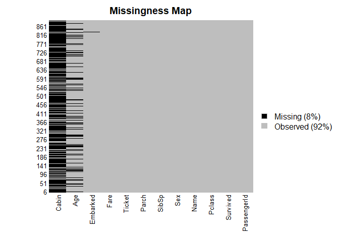
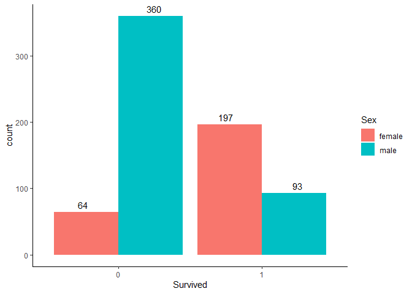
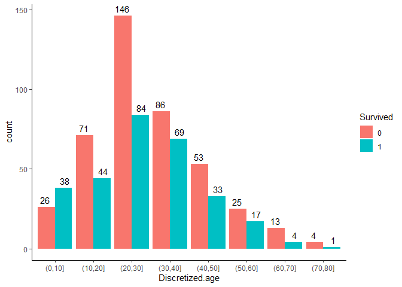
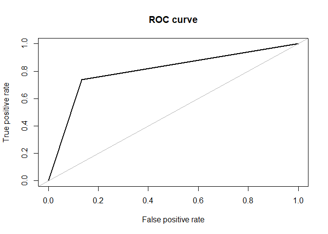
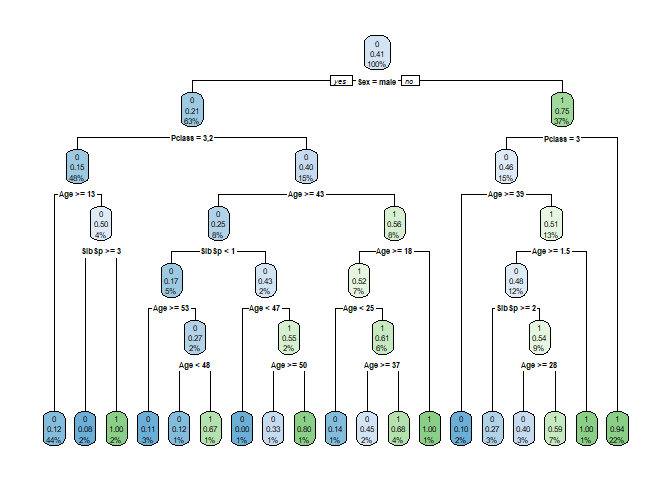
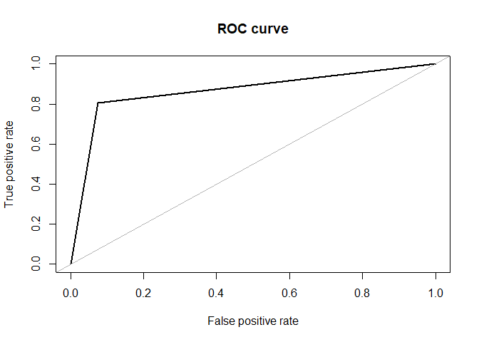
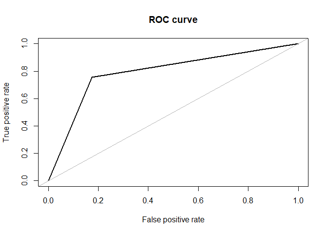

# Préambule

Le présent document a pour objectif de présenter de façon rudimentaire comment faire de la classification, en complément du TD 3 correspondant au cours de Statistique descriptive 2 dispensé en L2 MIASHS à l'Université Lumière Lyon 2 par [Stéphane CHRÉTIEN](https://sites.google.com/site/stephanegchretien/enseignement/l2-miashs-statistiques-descriptives/l2-statistiques-descriptives-2-regression-et-classification). Les consignes et le corrigé sont trouvables dans le répertoire `doc` ; `data` contient pour sa part les jeux de données utilisés dans le cadre du TD dans des formats simples d'usage.

*Ce document n'est pas un tutoriel pour R, et n'a pas pour but de remplacer le CM. En revanche, c'est la suite directe du TD 2, [trouvable ici](https://github.com/mpalenciaolivar/L2MIASHS2022-StatDesc2-TD2)*.

# Ressources utiles
## Ouvrages
- [Cours de Ricco RAKOTOMALALA sur la régression logistique (davantage de Statistique)](http://eric.univ-lyon2.fr/~ricco/cours/cours_regression_logistique.html)
- [Cours de Julien AH-PINE (davantage général)](https://eric.univ-lyon2.fr/~jahpine/cours/m2_sise-dm/cm.pdf)

## Ressources internet
- [Filtrer des données avec dplyr](https://cmdlinetips.com/2020/08/dplyr-filter-filter-select-rows-based-on-conditions/)
- De manière générale, tout ce qui est dans la galaxie [WikiStat](http://wikistat.fr/), mais en particulier :

  - [Statistique descriptive élémentaire](https://www.math.univ-toulouse.fr/~baccini/zpedago/asde.pdf)
  
  - [Pratique de la modélisation statistique](https://www.math.univ-toulouse.fr/~besse/pub/modlin.pdf)
  
  - [Exploration statistique multidimensionnelle](https://www.math.univ-toulouse.fr/~besse/pub/Explo_stat.pdf)

- Autrement :

  - [Decision Tree Algorithm, Explained](https://www.kdnuggets.com/2020/01/decision-tree-algorithm-explained.html)
  
  - [LOGIT REGRESSION | R DATA ANALYSIS EXAMPLES](https://stats.oarc.ucla.edu/r/dae/logit-regression/)
  
  - [Tutoriel Titanic (repris partiellement)](https://medium.com/analytics-vidhya/a-beginners-guide-to-learning-r-with-the-titanic-dataset-a630bc5495a8)
  
# Exercice 1
Ce notebook est un peu différent ; il s'agit de vous mettre un pied à l'étrier sur la pratique de la classification. Cet exercice est inédit, en ce sens qu'il n'est pas compris dans le sujet de TD. À ce titre, on mettra l'accent sur les ressources suivantes et sur le langage R :

- [Introduction à la data science – Du data mining au big data analytics](https://eric.univ-lyon2.fr/~ricco/cours/slides/intro_ds_from_dm_to_bd.pdf). On pourra trouver une version complémentaire [ici](https://eric.univ-lyon2.fr/~ricco/cours/slides/Introduction_au_Data_Mining.pdf) et les notes utilisées pendant la présentation [ici](https://github.com/mpalenciaolivar/L2MIASHS2022-StatDesc2-TD3/blob/main/doc/NotesTD3.pdf)

- [Apprentissage supervisé](https://eric.univ-lyon2.fr/~ricco/cours/slides/Apprentissage_Supervise.pdf)

- [Régression logistique façon Machine Learning](http://eric.univ-lyon2.fr/~ricco/cours/slides/logistic_regression_ml.pdf)

- [Classifieur bayésien naïf](http://eric.univ-lyon2.fr/~ricco/cours/slides/naive_bayes_classifier.pdf)


**Il ne sert à rien de courir : il faut d'abord lire les ressources PUIS faire le TD, et pas l'inverse.**

## Contexte
On cherche à prédire quels sont les individus qui survivront au nauffrage du [Titanic](https://fr.wikipedia.org/wiki/Titanic) à partir d'un certain nombre de variables.

## Dictionnaire de données


Avant même de considérer le code, il va falloir faire un petit travail de qualification des données. Ce n'est pas parce qu'une variable prend des valeurs "chiffre" que c'est une variable quantitative continue (ex : un rang).

## Pré-requis
Le projet va nécessiter un certain nombre de packages externes. Pour les installer, on ouvrira `requirements.R` et on cliquera sur `Run All` (CTRL+ALT+R).

## Chargement des données

Ici, on a déjà un split train/test de fait. Il ne manquera que le jeu de données de validation,
que l'on créera à partir de train. Ce sera à vous de tout faire pendant le projet, en n'omettant
pas de randomiser votre échantillonnage.


```r
# na.string est initialisé de la sorte afin que l'on puisse mieux gérer les données manquantes par la suite.
titanic <- read.csv(file.path("data", "titanic", "train.csv"), na.strings = "")
test <- read.csv(file.path("data", "titanic", "test.csv"), na.strings = "")
```

## Préparation des données
Comme souvent lorsque l'on travaille avec des données, il y a des valeurs manquantes, des colonnes mal typées, etc. Il faut y remédier avant toute chose. Commençons par jeter un oeil à nos données chargées :

```r
# Attention : cette fonction est faite pour fonctionner avec RStudio. Elle est utile pour faire des tris "à la Excel". Elle est commentée pour pouvoir exécuter le notebook sans interruption.
# View(titanic)
```

Voyons voir s'il y a des données manquantes :

```r
library(Amelia)  # Chargement de lib
```

```
## Loading required package: Rcpp
```

```
## ## 
## ## Amelia II: Multiple Imputation
## ## (Version 1.8.0, built: 2021-05-26)
## ## Copyright (C) 2005-2022 James Honaker, Gary King and Matthew Blackwell
## ## Refer to http://gking.harvard.edu/amelia/ for more information
## ##
```

```r
missmap(titanic, col = c("black", "grey"))
```

<!-- -->

Nous avons une variable Cabin qui a beaucoup de données manquantes, et une variable PassengerId qui est une pseudo-variable d'identifiants. Nous les excluerons de l'analyse. Nous suivrons notre tutoriel de référence dans un souci de simplicité (pour la pédagogie, donc). Mais la décision de faire d'abandonner d'autres variables que celles mentionnées précédemment qui a été prise par l'auteur du tuto me semble peu justifiée à certains égards. Par exemple, on enlève le prix payé et le port d'embarquement, sans justification autre
que l'intuition, sans vérification. Mais, en l'état, qui nous dit que parmi les survivants, il n'y a pas davantage de gens qui ont payé cher, et que ces gens ayant payé cher ont embarqué à un endroit plutôt qu'à un autre ? C'est une explication un peu recherchée et sans forcément de fondement, mais l'idée est là : le choix est méthodologiquement discutable pour faire de la sélection de variables (en l'absence d'analyse).

Puisque nous parlons de ce type de sélection, parlons également des outliers et des données aberrantes. De mon point de vue, une donnée aberrante est une valeur dont il est manifeste qu'il s'agit d'une erreur : une taille négative, par exemple. Si l'on peut appliquer un correctif, il faut le faire. Un outlier est pour sa part une valeur qui sort du lot. On peut souvent voir que les outliers sont retirés des données, sans plus de considération. C'est une erreur de jugement : tout d'abord, pourquoi le point que l'on cherche à retirer serait-il à retirer ? N'appartient-il pas à une sous-distribution (modèle de mélange par ex), n'est-il pas symptomatique d'autre chose ? Un exemple concret : prenons une chaîne de cafés, dont certains (mettons 1 ou 2) sont en centre-ville, la plupart dans le reste de la ville voire en périphérie. On étudie le chiffre d'affaires. Il semble assez logique que ceux en centre-ville fassent bien davantage de chiffre que ceux en périphérie... cela veut surtout dire qu'il s'agit de prendre en compte le lieu d'implantation, en l'espèce. Je préfère tenir compte des cas de ce type dans ma modélisation plutôt que de supprimer l'info, même lorsque je n'ai pas forcément la localisation parmi mes variables, mais juste un élément de connaissance métier (cela se fait en Statistique bayésienne). Et même si l'on choisissait de retirer une observation, il y a des techniques savantes (Statistique par ex) pour faire de la détection d'outlier. Il en va de même sur l'imputation de données manquantes, qui n'est parfois pas même désirable en fonction du contexte d'étude.


```r
library(dplyr)
```

```
## 
## Attaching package: 'dplyr'
```

```
## The following objects are masked from 'package:stats':
## 
##     filter, lag
```

```
## The following objects are masked from 'package:base':
## 
##     intersect, setdiff, setequal, union
```

```r
titanic <- select(titanic, Survived, Pclass, Age, Sex, SibSp, Parch)
test <- select(test, Survived, Pclass, Age, Sex, SibSp, Parch)
```

Il ne restera plus qu'à retirer les valeurs manquantes pour savoir ce que l'on traitera.


```r
titanic <- na.omit(titanic)
test <- na.omit(test)
```

Il s'agit maintenant de savoir comment sont codées nos variables.


```r
str(titanic)
```

```
## 'data.frame':	714 obs. of  6 variables:
##  $ Survived: int  0 1 1 1 0 0 0 1 1 1 ...
##  $ Pclass  : int  3 1 3 1 3 1 3 3 2 3 ...
##  $ Age     : num  22 38 26 35 35 54 2 27 14 4 ...
##  $ Sex     : chr  "male" "female" "female" "female" ...
##  $ SibSp   : int  1 1 0 1 0 0 3 0 1 1 ...
##  $ Parch   : int  0 0 0 0 0 0 1 2 0 1 ...
##  - attr(*, "na.action")= 'omit' Named int [1:177] 6 18 20 27 29 30 32 33 37 43 ...
##   ..- attr(*, "names")= chr [1:177] "6" "18" "20" "27" ...
```

Survived et Pclass sont considérées comme étant des variables numériques. Or, elles sont respectivement catégorielle et catégorielle *ordinale*. Transformons les.


```r
titanic$Survived <- factor(titanic$Survived)
titanic$Pclass <- factor(titanic$Pclass, order=TRUE, levels = c(3, 2, 1))

test$Survived <- factor(test$Survived)
test$Pclass <- factor(test$Pclass, order=TRUE, levels = c(3, 2, 1))
```

## Exploration des données
Il est temps de commencer à regarder nos données. Allons-y !

### Corrélations

```r
library(GGally)
```

```
## Loading required package: ggplot2
```

```
## Registered S3 method overwritten by 'GGally':
##   method from   
##   +.gg   ggplot2
```

```r
ggcorr(titanic,
       nbreaks = 6,
       label = TRUE,
       label_size = 3,
       color = "grey50")
```

```
## Warning in ggcorr(titanic, nbreaks = 6, label = TRUE, label_size = 3, color =
## "grey50"): data in column(s) 'Survived', 'Pclass', 'Sex' are not numeric and
## were ignored
```

<!-- -->

### Comptage du nombre de survivants

```r
library(ggplot2)

ggplot(titanic, aes(x = Survived)) +
  geom_bar(width=0.5, fill = "coral") +
  geom_text(stat='count', aes(label=stat(count)), vjust=-0.5) +
  theme_classic()
```

<!-- -->

### Comptage du nombre de survivants en fonction du sexe

```r
ggplot(titanic, aes(x = Survived, fill = Sex)) +
 geom_bar(position = position_dodge()) +
 geom_text(stat='count', 
           aes(label=stat(count)), 
           position = position_dodge(width=1), vjust=-0.5)+
 theme_classic()
```

<!-- -->

### Comptage du nombre de survivants en fonction de Pclass

```r
ggplot(titanic, aes(x = Survived, fill = Pclass)) +
 geom_bar(position = position_dodge()) +
 geom_text(stat='count',
           aes(label=stat(count)), 
           position = position_dodge(width=1), 
           vjust=-0.5)+
 theme_classic()
```

<!-- -->

### Densité de l'âge

```r
ggplot(titanic, aes(x = Age)) +
 geom_density(fill='coral')
```

<!-- -->

### Survie en fonction de l'âge

```r
# Discrétisation de l'âge
titanic$Discretized.age <- cut(titanic$Age, c(0, 10, 20, 30, 40 ,50, 60, 70, 80, 100))

ggplot(titanic, aes(x = Discretized.age, fill = Survived)) +
  geom_bar(position = position_dodge()) +
  geom_text(stat='count', aes(label=stat(count)), position = position_dodge(width=1), vjust=-0.5)+
  theme_classic()
```

<!-- -->

```r
titanic$Discretized.age <- NULL
```

## Constitution des jeux pour l'apprentissage

```r
# Attention: il n'y a pas de randomisation ici puisque le jeu de données est déjà randomisé. CETTE RANDOMISATION EST NÉCESSAIRE !
# S'il y en avait, il aurait fallu exécuter la fonction avec une seed, tel que :

# set.seed(2022)

train_validation_split <- function(data, fraction = 0.8, train = TRUE) {
  total_rows <- nrow(data)
  train_rows <- fraction * total_rows
  sample <- 1:train_rows
  if (train == TRUE) {
    return (data[sample, ])
  } else {
    return (data[-sample, ])
  }
}


train <- train_validation_split(titanic, 0.8, train = TRUE)
validation <- train_validation_split(titanic, 0.8, train = FALSE)
```

## Arbre de décision

```r
library(rpart)
library(rpart.plot)

set.seed(2022)
dtree <- rpart(Survived ~ ., data = train, method = 'class')
rpart.plot(dtree, extra = 106)
```

<!-- -->

On évalue le modèle:


```r
library(MLmetrics)
```

```
## 
## Attaching package: 'MLmetrics'
```

```
## The following object is masked from 'package:base':
## 
##     Recall
```

```r
y_pred <- predict(dtree, validation, type = 'class')
y_true <- validation$Survived

dtree_precision <- Precision(y_true, y_pred, positive = 1)
dtree_recall <- Recall(y_true, y_pred, positive = 1)
dtree_f1 <- F1_Score(y_true, y_pred, positive = 1)
dtree_auc <- AUC(y_true, y_pred)

paste0("Precision: ", dtree_precision)
```

```
## [1] "Precision: 0.737704918032787"
```

```r
paste0("Recall: ", dtree_recall)
```

```
## [1] "Recall: 0.803571428571429"
```

```r
paste0("F1 Score: ", dtree_f1)
```

```
## [1] "F1 Score: 0.769230769230769"
```

```r
paste0("AUC: ", dtree_auc)
```

```
## [1] "AUC: 0.801779288284686"
```


```r
library(ROSE)
```

```
## Loaded ROSE 0.0-4
```

```r
roc.curve(y_pred, y_true, plotit = TRUE, add.roc = FALSE, 
          n.thresholds=100)
```

<!-- -->

```
## Area under the curve (AUC): 0.802
```

On affine notre arbre (fine tuning) :


```r
set.seed(2022)

control <- rpart.control(minsplit = 8,
                         minbucket = 2,
                         maxdepth = 6,
                         cp = 0)
dtree_tuned_fit <- rpart(Survived ~ ., data = train, method = 'class', control = control)
y_pred <- predict(dtree_tuned_fit, validation, type = 'class')

dtree_tuned_fit_precision <- Precision(y_true, y_pred, positive = 1)
dtree_tuned_fit_recall <- Recall(y_true, y_pred, positive = 1)
dtree_tuned_fit_f1 <- F1_Score(y_true, y_pred, positive = 1)
dtree_tuned_fit_auc <- AUC(y_true, y_pred)

paste0("Precision: ", dtree_tuned_fit_precision)
```

```
## [1] "Precision: 0.806451612903226"
```

```r
paste0("Recall: ", dtree_tuned_fit_recall)
```

```
## [1] "Recall: 0.892857142857143"
```

```r
paste0("F1 Score: ", dtree_tuned_fit_f1)
```

```
## [1] "F1 Score: 0.847457627118644"
```

```r
paste0("AUC: ", dtree_tuned_fit_auc)
```

```
## [1] "AUC: 0.866188769414576"
```

```r
rpart.plot(dtree_tuned_fit, extra = 106)
```

<!-- -->


```r
roc.curve(y_pred, y_true, plotit = TRUE, add.roc = FALSE, 
          n.thresholds=100)
```

<!-- -->

```
## Area under the curve (AUC): 0.866
```

## Régression logistique
Même si la régression logistique est ici présentée sous l'angle de la classification, elle est fondamentalement, intrinsèquement, décidément - notez que j'insiste - une régression. On renverra surtout aux ressources mises en ligne par R. RAKOTOMALALA pour la vision Statistique de la chose.


```r
set.seed(2022)

# On standardise les variables numériques
data_rescale <- mutate_if(titanic,
                          is.numeric,
                          list(~as.numeric(scale(.))))
train <- train_validation_split(data_rescale, 0.7, train = TRUE)
validation <- train_validation_split(data_rescale, 0.7, train = FALSE)
logreg <- glm(Survived ~ ., data = train, family = "binomial")
summary(logreg)
```

```
## 
## Call:
## glm(formula = Survived ~ ., family = "binomial", data = train)
## 
## Deviance Residuals: 
##     Min       1Q   Median       3Q      Max  
## -2.5920  -0.6739  -0.4134   0.6367   2.3344  
## 
## Coefficients:
##              Estimate Std. Error z value Pr(>|z|)    
## (Intercept)  1.419361   0.196762   7.214 5.45e-13 ***
## Pclass.L     1.555536   0.228015   6.822 8.97e-12 ***
## Pclass.Q    -0.063754   0.217026  -0.294 0.768940    
## Age         -0.532113   0.138546  -3.841 0.000123 ***
## Sexmale     -2.569211   0.251982 -10.196  < 2e-16 ***
## SibSp       -0.316053   0.135620  -2.330 0.019784 *  
## Parch       -0.009988   0.127804  -0.078 0.937709    
## ---
## Signif. codes:  0 '***' 0.001 '**' 0.01 '*' 0.05 '.' 0.1 ' ' 1
## 
## (Dispersion parameter for binomial family taken to be 1)
## 
##     Null deviance: 677.21  on 498  degrees of freedom
## Residual deviance: 461.88  on 492  degrees of freedom
## AIC: 475.88
## 
## Number of Fisher Scoring iterations: 4
```

Cette sortie est la même que pour une régression linéaire. Encore une fois, c'est parce que la *régression logistique est une régression et non un classifieur en soi*. Voyons comment cela se passe sur la significativité globale :


```r
LR <- logreg$null.deviance - logreg$deviance
p <- logreg$df.null - logreg$df.residual
pchisq(LR, p, lower.tail = F)
```

```
## [1] 1.031983e-43
```

En supposant un risque à 5%, on est bien en-deçà. On a donc bien un modèle informatif. Le souci, c'est que cette façon d'évaluer le modèle va favoriser un modèle avec le plus de prédicteurs qu'un autre. Or, nous voulons un modèle proposant un ajustement raisonnable qui, pour autant, ne soit pas composé de l'intégralité des données. On peut utiliser l'AIC pour sélectionner des modèles tout en contrant cet effet. On se réfèrera au TD 2 pour voir comment utiliser l'AIC.


```r
aic_logreg <- AIC(logreg)
aic_logreg
```

```
## [1] 475.8848
```

Cela marche aussi pour le BIC.


```r
bic_logreg <- BIC(logreg)
bic_logreg
```

```
## [1] 505.3731
```


```r
y_true <- validation$Survived
y_pred <- predict(logreg, validation, type = 'response')
y_pred <- as.factor(ifelse(y_pred > 0.5, 1, 0))

logreg_precision <- Precision(y_true, y_pred, positive = 1)
logreg_recall <- Recall(y_true, y_pred, positive = 1)
logreg_f1 <- F1_Score(y_true, y_pred, positive = 1)
logreg_auc <- AUC(y_true, y_pred)
paste0("Precision: ", logreg_precision)
```

```
## [1] "Precision: 0.756410256410256"
```

```r
paste0("Recall: ", logreg_recall)
```

```
## [1] "Recall: 0.710843373493976"
```

```r
paste0("F1 Score: ", logreg_f1)
```

```
## [1] "F1 Score: 0.732919254658385"
```

```r
paste0("AUC: ", logreg_auc)
```

```
## [1] "AUC: 0.790613887329216"
```


```r
roc.curve(y_pred, y_true, plotit = TRUE, add.roc = FALSE, 
          n.thresholds=100)
```

<!-- -->

```
## Area under the curve (AUC): 0.791
```

## Classifieur bayésien naïf

```r
library(e1071)

set.seed(2022)
nbClassifier <- naiveBayes(Survived ~., data = train)
y_pred <- predict(nbClassifier, validation)
y_true <- validation$Survived

nbClassifier_precision <- Precision(y_true, y_pred, positive = 1)
nbClassifier_recall <- Recall(y_true, y_pred, positive = 1)
nbClassifier_f1 <- F1_Score(y_true, y_pred, positive = 1)
nbClassifier_auc <- AUC(y_true, y_pred)
paste0("Precision: ", nbClassifier_precision)
```

```
## [1] "Precision: 0.774647887323944"
```

```r
paste0("Recall: ", nbClassifier_recall)
```

```
## [1] "Recall: 0.662650602409639"
```

```r
paste0("F1 Score: ", F1_Score(y_true, y_pred, positive = 1))
```

```
## [1] "F1 Score: 0.714285714285714"
```

```r
paste0("AUC: ", nbClassifier_auc)
```

```
## [1] "AUC: 0.79010172143975"
```


```r
roc.curve(y_pred, y_true, plotit = TRUE, add.roc = FALSE, 
          n.thresholds=100)
```

<!-- -->

```
## Area under the curve (AUC): 0.790
```

## Comparaison et sauvegarde d'un modèle
Nous avons 4 modèles. L'heure est à la comparaison des performances. Mon indice
préféré est le F1-Score, car il s'agit d'une moyenne (harmonique). En fonction
des cas, on pourra placer davantage d'importance sur la précision ou sur le
rappel, et tout de même synthétiser cela au sein du Beta-F1-Score. Faisons un
dataframe de nos indices.


```r
dtree_perfs <- list(precision = dtree_precision,
                    recall = dtree_recall,
                    f1_score = dtree_f1,
                    auc = dtree_auc)

dtree_tuned_fit_perfs <- list(precision = dtree_tuned_fit_precision,
                              recall = dtree_tuned_fit_recall,
                              f1_score = dtree_tuned_fit_f1,
                              auc = dtree_tuned_fit_auc)

logreg_perfs <- list(precision = logreg_precision,
                     recall = logreg_recall,
                     f1_score = logreg_f1,
                     auc = logreg_auc)

nbClassifier_perfs <- list(precision = nbClassifier_precision,
                           recall = nbClassifier_recall,
                           f1_score = nbClassifier_f1,
                           auc = nbClassifier_auc)

# Pas très élégant, mais ça marche
perfs <- as.data.frame(t(do.call(rbind, Map(data.frame,
                       dtree = dtree_perfs,
                       dtree_tuned = dtree_tuned_fit_perfs,
                       logreg = logreg_perfs,
                       nbClassifier = nbClassifier_perfs))))

# On trie par f1-score décroissant
# Il faudra télécharger le notebook pour voir les scores correctement
attach(perfs)
perfs[order(-f1_score),]
```

<div data-pagedtable="false">
  <script data-pagedtable-source type="application/json">
{"columns":[{"label":[""],"name":["_rn_"],"type":[""],"align":["left"]},{"label":["precision"],"name":[1],"type":["dbl"],"align":["right"]},{"label":["recall"],"name":[2],"type":["dbl"],"align":["right"]},{"label":["f1_score"],"name":[3],"type":["dbl"],"align":["right"]},{"label":["auc"],"name":[4],"type":["dbl"],"align":["right"]}],"data":[{"1":"0.8064516","2":"0.8928571","3":"0.8474576","4":"0.8661888","_rn_":"dtree_tuned"},{"1":"0.7377049","2":"0.8035714","3":"0.7692308","4":"0.8017793","_rn_":"dtree"},{"1":"0.7564103","2":"0.7108434","3":"0.7329193","4":"0.7906139","_rn_":"logreg"},{"1":"0.7746479","2":"0.6626506","3":"0.7142857","4":"0.7901017","_rn_":"nbClassifier"}],"options":{"columns":{"min":{},"max":[10]},"rows":{"min":[10],"max":[10]},"pages":{}}}
  </script>
</div>

```r
detach(perfs)
```

Notre gagnant est l'arbre de décision avec tuning. Puisque nous avons notre
vainqueur, il peut être judicieux de le sauvegarder pour le réutiliser. C'est
très facile à faire (décommenter les fonctions):


```r
# saveRDS(dtree_tuned_fit, "dtree_tuned_fit.rds")
# dtree_tuned_fit <- readRDS("dtree_tuned_fit.rds")
```

## Test du modèle
Nous avons entraîné/tuné un modèle ; il est maintenant temps de le tester sur
des données totalement inédites du point de vue de l'entraînement. Il faut
traiter les données nouvelles de la même façon que les données d'entraînement
au préalable. Cela a été fait en même temps que le reste des données, dans les
sections dédiées. Voyons maintenant la performance "réelle", sur données test:


```r
y_pred <- predict(dtree_tuned_fit, test, type = 'class')
y_true <- test$Survived

dtree_tuned_fit_precision <- Precision(y_true, y_pred, positive = 1)
dtree_tuned_fit_recall <- Recall(y_true, y_pred, positive = 1)
dtree_tuned_fit_f1 <- F1_Score(y_true, y_pred, positive = 1)
dtree_tuned_fit_auc <- AUC(y_true, y_pred)

paste0("Precision: ", dtree_tuned_fit_precision)
```

```
## [1] "Precision: 0.797101449275362"
```

```r
paste0("Recall: ", dtree_tuned_fit_recall)
```

```
## [1] "Recall: 0.866141732283465"
```

```r
paste0("F1 Score: ", dtree_tuned_fit_f1)
```

```
## [1] "F1 Score: 0.830188679245283"
```

```r
paste0("AUC: ", dtree_tuned_fit_auc)
```

```
## [1] "AUC: 0.85473629164799"
```

# Exercice 2
Cet exercice - facultatif et pas forcément indispensable au projet, c'est selon votre cas - est purement informatique. En effet : nous travaillons avec un ordinateur, qui est doté de ressources limitées. Mais, que faire lorsque nous ne pouvons pas charger un fichier entier en mémoire vive (RAM) ? Eh bien, il est possible de travailler quand même, malgré le fait que le fichier ne tienne pas sur la RAM si l'on cherche à le charger d'un coup. On échange de la mémoire contre du temps de traitement. On va ici montrer une façon de faire en R. Ce n'est pas la seule façon de faire, ni forcément la meilleure, mais elle a le mérite d'être clé en main. Parfait pour des étudiants de L2 MIASHS !

Pour faire cet exercice, il faudra télécharger le jeu de données du [projet](https://github.com/mpalenciaolivar/L2MIASHS2022-StatDesc2-Projet/blob/main/docs/L2MIASHS2022_Projet_Statistique_Descriptive_2.pdf), en décompresser l'archive et placer le csv dans le répertoire data. Il n'est pas fourni directement du fait de limitations imposées par GitHub sur la taille des fichiers.

On commence par charger les packages suivants :


```r
library(disk.frame)
```

```
## 
## 
##  Thank you for using {disk.frame}. However {disk.frame} has been soft-deprecated. You are recommended to switch over to using the {arrow} package for handling larger-than-RAM data. You can convert your existing disk.frames to the parquet format which {arrow} can use by using:
## 
## 
## ```
## disk.frame::disk.frame_to_parquet(path.to.your.disk.frame, parquet_path)
## ````
## 
## Once done you can use {arrow}'s dataset features to manipulate the larger-than-RAM data using dplyr verbs. E.g.
## 
## ```
## dataset = arrow::open_dataset(parquet_path)
## 
## parquet_path |>
##   mutate(...) |>
##   group_by(...) |>
##   summarize(...) |>
##   collect(...)
## ```
## 
## ## Message from disk.frame:
## We have 1 workers to use with disk.frame.
## To change that, use setup_disk.frame(workers = n) or just setup_disk.frame() to use the defaults.
## 
## 
## It is recommended that you run the following immediately to set up disk.frame with multiple workers in order to parallelize your operations:
## 
## 
## ```r
## # this will set up disk.frame with multiple workers
## setup_disk.frame()
## # this will allow unlimited amount of data to be passed from worker to worker
## options(future.globals.maxSize = Inf)
## ```
```

```
## 
## Attaching package: 'disk.frame'
```

```
## The following objects are masked from 'package:base':
## 
##     colnames, ncol, nrow
```

```r
library(parallel)
```
Un peu de configuration :


```r
nCores <- detectCores()    # Dépend de la machine
setup_disk.frame(workers = nCores)
```

```
## The number of workers available for disk.frame is 8
```

```r
options(future.globals.maxSize = Inf)
```

On va maintenant morceler notre package en lots (les chunks) dont la taille est recommandée par des fonctions.


```r
df <- csv_to_disk.frame(
  file.path("data", "train.csv"), 
  outdir = file.path("data", "train.df"),
  inmapfn = base::I,
  recommend_nchunks(sum(file.size(file.path("data", "train.csv")))),
  backend = "data.table")
```

On peut désormais accéder au csv via le dataframe df, même si l'ensemble des données n'est pas totalement en mémoire. R le charge par parties, mais on peut quand même manipuler le dataframe entier, mais par lots, ou chunks. Ainsi, si l'on veut renvoyer le premier chunk :


```r
df[1,]
```

```
## data.table syntax for disk.frame may be moved to a separate package in the future
```

<div data-pagedtable="false">
  <script data-pagedtable-source type="application/json">
{"columns":[{"label":["id"],"name":[1],"type":["int"],"align":["right"]},{"label":["step"],"name":[2],"type":["int"],"align":["right"]},{"label":["type"],"name":[3],"type":["chr"],"align":["left"]},{"label":["amount"],"name":[4],"type":["dbl"],"align":["right"]},{"label":["nameOrig"],"name":[5],"type":["chr"],"align":["left"]},{"label":["oldbalanceOrg"],"name":[6],"type":["dbl"],"align":["right"]},{"label":["newbalanceOrig"],"name":[7],"type":["dbl"],"align":["right"]},{"label":["nameDest"],"name":[8],"type":["chr"],"align":["left"]},{"label":["oldbalanceDest"],"name":[9],"type":["dbl"],"align":["right"]},{"label":["newbalanceDest"],"name":[10],"type":["dbl"],"align":["right"]},{"label":["isFraud"],"name":[11],"type":["int"],"align":["right"]},{"label":["isFlaggedFraud"],"name":[12],"type":["int"],"align":["right"]}],"data":[{"1":"1","2":"1","3":"PAYMENT","4":"9839.64","5":"C1231006815","6":"170136","7":"160296.36","8":"M1979787155","9":"0","10":"0","11":"0","12":"0"},{"1":"1588910","2":"155","3":"PAYMENT","4":"2252.05","5":"C1343131972","6":"0","7":"0.00","8":"M1025862390","9":"0","10":"0","11":"0","12":"0"},{"1":"3180323","2":"239","3":"PAYMENT","4":"7571.75","5":"C961484155","6":"21311","7":"13739.25","8":"M9724199","9":"0","10":"0","11":"0","12":"0"},{"1":"4770226","2":"334","3":"PAYMENT","4":"13382.30","5":"C1813010320","6":"364614","7":"351231.70","8":"M323689954","9":"0","10":"0","11":"0","12":"0"}],"options":{"columns":{"min":{},"max":[10]},"rows":{"min":[10],"max":[10]},"pages":{}}}
  </script>
</div>

Si l'on veut un échantillon aléatoire :


```r
train <- collect(sample_frac(df, 0.60))
```

À noter que la proportion correspond généralement à celle prise pour un jeu de données d'entraînement. En fait, on retrouve souvent :

- 60% pour l'entraînement ;

- 20% pour la validation ;

- 20% pour le test.

Sachant qu'en principe, et hors bootstrapping, on ne devrait pas retrouver les mêmes individus entre les jeux de données. À vous de reproduire la procédure d'échantillonnage, de telle sorte à ce que l'on ait des individus différents entre les 3 groupes (filtrez sur les id ! Aidez-vous de [ceci](https://cmdlinetips.com/2020/08/dplyr-filter-filter-select-rows-based-on-conditions/)). Un dernier point : pour l'instant, train est chargé en mémoire. Il peut être judicieux de l'écrire et de l'effacer pour gérer le reste du jeu de données, autrement, cela reviendrait à charger tout le jeu de données d'un coup et donc, procéder comme on l'a fait devient inutile. *A priori*, vous n'avez *aucune* raison d'avoir les 3 parties du jeu de données en mémoire en même temps. De même, souvenez-vous que l'on étudie *un échantillon* plutôt qu'une population, ce n'est donc pas grave que l'on n'ait pas d'indicateurs ou de graphiques sur tout le jeu de données, même si - encore une fois - plus il y en a, plus on s'approche de la valeur réelle, en principe.
